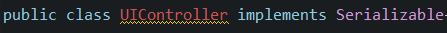

# Zadanie Poistovna
Filip Vida

A Java project demonstrating the usage of OOP principles and a baisc GUI.
#### Default Login Information
2 predefined employees 

Username: Filip Password: Filip

Username: Dusan Password: Dusan

Any created customers(via UI) can then login with Username: NameOfCustomer Password: NameOfCustomer

For list of changes/versions see github commits.

UML and goal of project included in repository.

Javadoc included in Zadanie/doc
#### Agreggation

#### Composition

#### Inheritance trees

#### Polymorphism

#### Separation of Logic an UI

#### Odovzdanie 3
#### Encapsulation

#### Polymorphism 1
See Section Polymorphism
#### Polymorphism 2

#### Interface

#### Dalšie kritériá
#### Serialization

#### Generic Class

#### Exception

#### Lambda expression

#### Observer Model

#### GUI separation with custom handlers
See section Separation of Logic an UI
#### Multithreading

#### Inner Interface
(In Printer.java)

